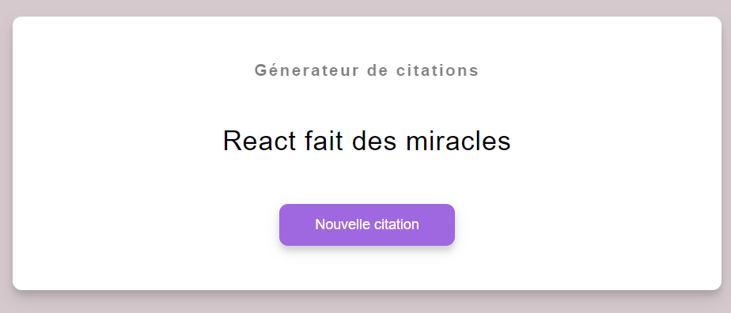
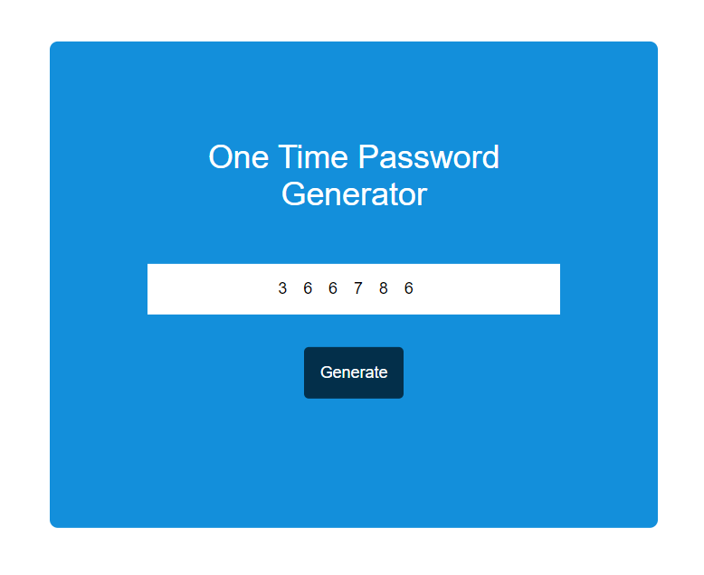
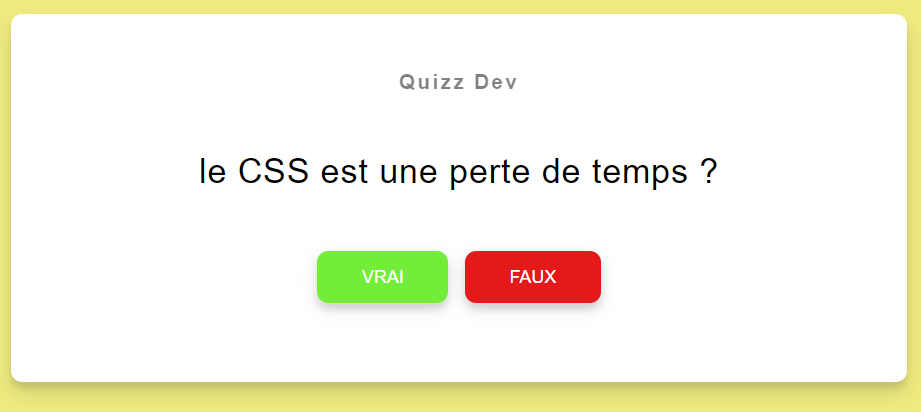
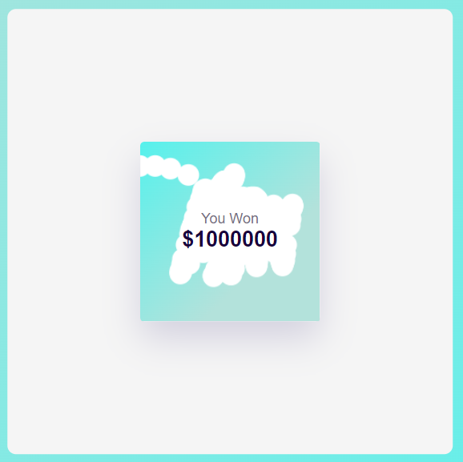

## Js Goat

this repository brings together 5 mini projects that I made to improve my skills in javascript.

## 1.Quote Generator

is a quote generator app that render quotes from a list to the layout.

## Screenshot 📸

## Skills Gained 🧠

DOM manipulation, Asynchronous JavaScript,Dynamique styling.

## 2.OTP generator

Generate random password of lenght (6)

## Screenshot 📸

## Skills Gained 🧠

Randomization techniques, Validation, Event Handling, User Interaction.

## 3.Quizz App

A quizz with good or bad answering alert message

## Screenshot 📸

## Skills Gained 🧠

Logical Conditionals, Data Structures, Timers, Responsive Design, User Feedback.

## 4.Scratch Card

A virtual card that the user "scratches" to reveal hidden content.

## Screenshot 📸

## Skills Gained 🧠

Canvas API, Advanced Event Handling, Performance Optimization, Interactive Effects.
